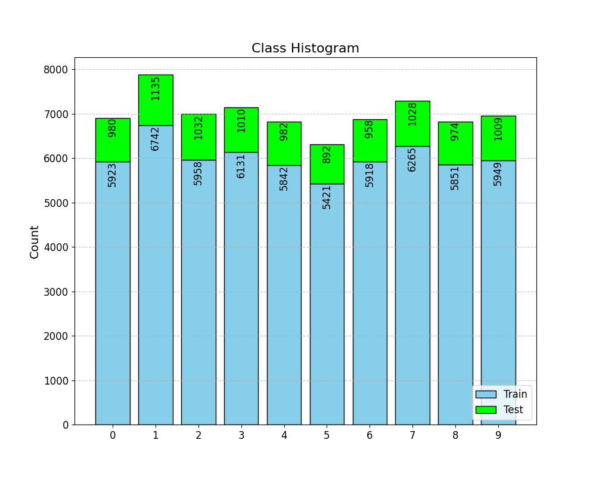

# KIV/ANLP assignment 01

## Implement Training Loop and Experiment with Hyper-Parameters

## Prerequisities
1. Instal PyTorch (https://pytorch.org/)
2. Run Hello world (cpu/gpu)
3. Create account on MetaCentrum

## Tasks 

## Our team work  [0pt]

Complete missing parts and design clear interface for experimenting.
1. Use python argparser 
2. Use wandb and log everything
3. For easy login and testing use environment variable WANDB_API_KEY 
4. Run minimalistic hello world on MetaCentrum

## Individual work **[13pt in total]**

### Dataset Analysis **[1pt]**
Create histogram of classes in the dataset. 

### Baseline analysis **[1.5pt]**
How would look accucary metric for **random model** and **majority class model**(returns only majority class as an output)

_For the random model, the accuracy would be approximately 1/number_of_classes, thus approximately 0.1 since the classes are balanced._

_For the majority class model, the accuracy would be the number of samples of the majority class divided by the total number of samples.
The number of samples of the majority class is 1135, so the accuracy would be 1135/10000 = 0.1135 on the test dataset._

For the implementation see the code in the file `random_and_majority_model.py`.

Is there any drawback? Can we use something better, why?

_The drawback of the majority class model is that it is not able to predict any other class than the majority class. 
Thus not providing much information about the data.
Same with the random model, it doesn't provide any useful information about the data.
However, they can serve as a good baseline for the model to beat._

_Pretty much any model would be better than these two models, as long as it takes the features into account._

1. Implement missing fragments in template main01.py
2. Implement 3-layer MLP with ReLU activation function **CF#Dense** 
3. Run Experiments **[3pt]**
   1. Run at least 5 experiments with all possible combinations of following hyper-parameters 
   2. Draw parallel coordinates chart and add image output into output section in this README.md
 

            `model: ["dense", "cnn"]`
            `lr: [0.1, 0.01, 0.001, 0.0001, 0.00001]`
            `optimizer: ["sgd","adam"]`
            `dp: [0, 0.1, 0.3, 0.5]`

   Each experiment train at least for 2 epochs.

 

4. Utilize MetaCentrum **[3pt]**

   For HP search modify attached scripts and utilize cluster MetaCentrum. 
https://metavo.metacentrum.cz/

# My results
## Parallel Coordinate Chart with Appropriate Convenient Setup **[0.5pt]**
Draw parallel coordinate chart with all tunned hyper parameters

1. Show all your runs **[0.5pt]**

2. Show only runs better than random baseline. **[0.5pt]**

_- used random model accuracy as a baseline (10%)_

## Table of my results **[1pt]**
1. show 2 best HP configuration for dense and cnn model 
(both configurations run 5 times and add confidence interval to the table)
2. add random and majority class models into the result table
3. mark as bold in the table

_MISSING_

## Present all konvergent runs **[0.5pt]**
_MISSING_

## Present all divergent runs **[0.5pt]**
_MISSING_

## Discussion **[1pt]**
- Discuss the results. 
- Try to explain why specific configurations work and other not. 
- Try to discuss the most interesting points in your work. 
- Is there something that does not make any sense? Write it here with your thoughts. 

_MISSING_

## Try to explain why specific configurations works better than others. 

_MISSING_

# Something to think about

1. How to estimate the batch size?
2. What are the consequences of using a larger/smaller batch size?
3. What is the impact of batch size on the final accuracy of the system?
4. What are the advantages/disadvantages of calculating the test on a smaller/larger number of data samples?
5. When would you use such a technique?
6. How to set the number of epochs when training models?
7. Why do the test and train loss start with similar values? Can initial values have any special significance?
8. Is there any reason to set batch_size differently for train/dev/test?
9. When is it appropriate to use learning rate (LR) decay?

                                                                   

