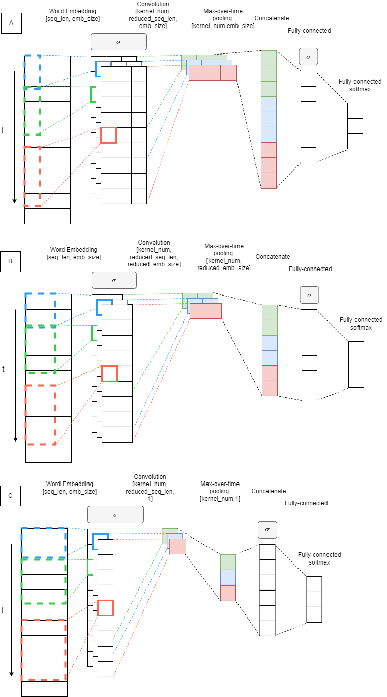
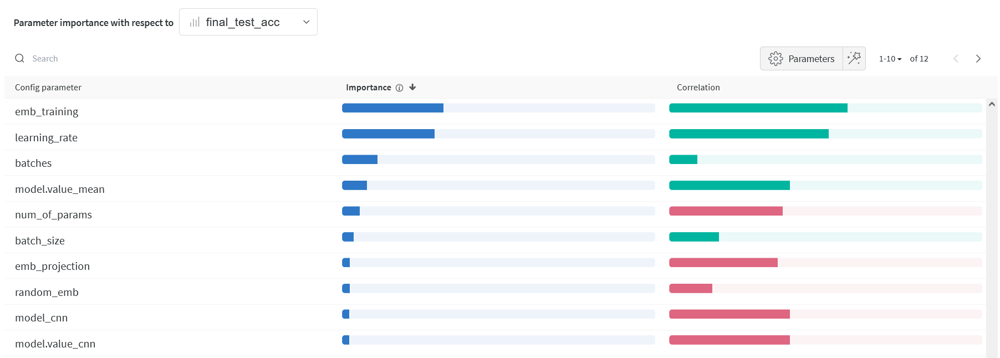

# KIV / ANLP Exercise 03

*Deadline to push results:* 2024-11-10 (San) 23:59:59

*Maximum points:*

The Goal
========

Implement missing parts in the given template of the supervised machine
learning stack for predicting sentiment of given sequence (Sentiment Classification Task).
Train and evaluate the system on the given data set. Use architectures described in the
following section.

What is Semantic Sentiment Analysis
===================================
Varies by domain (most common: 2-3 classification) It is not a dogma...

CSFD Sentiment Czech Dataset (user ranking 0-100%): positive,neutral,negative

Project Structure
=================

- [tests]
- [data]
    - *csfd-train.tsv*
    - *csfd-test.tsv*
- *main03.py*

The Data Set
============

- Your dataset is split : train/test
- Your dataset has labels in tsv
    - negative:0
    - neutral:1
    - positive:2

Tasks \[20+5 points in total\]
===============================

1. **Analyze the Dataset**

**CF\#STATISTICS**

- You can use scripts from Exercise 02 as a starting point.
- Count occurrences of words in the data set, and prepare a list of
  top\_n words
- Count statistics about coverage of tokens in training dataset
- Coverage is ratio between tokens you have in your vocabulary and all tokens.
  Do not count pad tokens
- Count statistics about class distribution in dataset (train/test)

  

  

  As shown in the histograms, both train and test datasets are balanced.

  

  The figure above shows the distribution of text lengths in the training dataset.
  This can really help with setting the sequence length for the model.
  I chose the sequence length to be 100, which corresponds to the 88th percentile of the text length distribution.

# NOTE:

- **Test imports change to:**
  `from cv03.main03 import load_embs`
- For unit test compatibility with cv02, I swear I did not change anything in the code.

2. **Prepare Word Embeddings**.
   https://drive.google.com/file/d/1MTDoyoGRhvLf15yL4NeEbpYLbcBlDZ3c/view?usp=sharing

[//]: # (# https://fasttext.cc/docs/en/crawl-vectors.html)

[//]: # (# EMB_FILE = "b:/embeddings/Czech &#40;Web, 2012, 5b tokens &#41;/cztenten12_8-lema-lowercased.vec")
Use the *list of top N word*s for pruning the given Word embeddings.

!! - - IMPORTANT - - !!

**Force vocab size (N most frequent words from the train dataset)
Words without embedding in the given emb file initialize randomly**

The cache will be stored on the hard drive for future use.
You should see two new files *word2idx.pckl* and *vecs.pckl*

3. **Prepare Dataset for Training**

Use load_dataset from datasets to load csv dataset.

    from datasets import load_dataset

    cls_dataset = load_dataset("csv", delimiter='\t', data_files={"train": [CSFD_DATASET_TRAIN],
                                                                "test": [CSFD_DATASET_TEST]})

7. **Implement training loop**
    1. Implement basic training loop.
    2. Implement testing for model and dataset

8. **Implement Embedding Averaging Model - Our Baseline**

Implement model which uses average of sequence embeddings to represent the sequence.

The Model takes sequence of numbers as an input [SEQ_LEN]. Use prepared word embeddings (task-2) to lookup word
vectors from ids [SEQ_LEN,EMB_SIZE]. Freeze embeddings. Add one trainable projection layer on top of the
embedding layer [SEQ_LEN,EMB_PROJ]. Use the mean of all words vectors in a sequence as
a representation of the sequence [EMB_PROJ].

Add classification head [NUM_OF_CLASSES].

Primitives to use:

- nn.Embedding
- nn.Softmax
- nn.Linear
- nn.Dropout
- nn.[activation]

**[5pt]**

10. **Implement CNN Model**

    

    For implementing architecture of the model use configuration in form of list,
    where each item correspond to a setup of one layer of the model (prepared in **CF\#CNN_CONF**).

Primitives to use:

- nn.Embedding
- nn.Conv1d, nn.Conv2d
- nn.MaxPool1d, nn.MaxPool2d
- nn.Dropout
- nn.Linear

11. **Log these:**

    MANDATORY_HP = ["activation", "model", "random_emb", "emb_training", "emb_projection", "lr", "proj_size", "batch_size"]
    MANDATORY_HP_CNN = ["cnn_architecture", "n_kernel", "hidden_size"]
    MANDATORY_M = ["train_acc", "test_loss", "train_loss"]

# NOTE:

Here I struggled a bit with what the hidden_size should be and how to choose the size.
I ended up choosing the sizes so that the unit tests would pass, so just few trials and errors.
For the architecture B, I have changed the dimensions of the kernel to `config["proj_size"] // 2` to serve
more as a compromise between the two architectures A and C.

13. **Run Experiments with different Hyper-parameters**

13. **[5pt]** **The best performing experiment run at least 10 times**
    To these runs add special tag : `best`

14. **[5pt]** **Tune More Voluntarily**
    You can use any technique in scope of CNN architecture.
    Best performing CNN gets 5 extra points.
    If confidence intervals of more students overlay, each student gets extra points.

# My results **[5pt]**

# NOTE FOR THE FUTURE:

I had to change the requirements.txt file to include

`tqdm==4.66.5` because of datasets 3.0.2 dependency on it, and

`datasets~=3.0.2`

## Hyper Parameter Analysis

I again used the naming convention from the previous exercise, so the hyperparameters are stored in the run name.
I also split the dataset to 3 parts: train, validation, test - I'm used to this naming.
But since the naming convention from previous exercises the train is the training dataset, validation dataset is
named as test (used during training loop), and the test dataset is named as final_test (used only ones, non-seen data).
Sorry if this is confusing.

### Parallel Coordinate Chart

Here is the parallel coordinate chart for runs with final test accuracy above 0.7. Interesting insight is that only
some learning rates are present, meaning that only some learning rates performed well.

Here are only CNN runs with final test accuracy above 0.6. We can clearly see that the embedding projection
helped these models. Otherwise, we can´t see much from this chart.

Here are only mean runs with final test accuracy above 0.71. Here is interesting that the embedding training
seems to be important for the mean model.

## Confusion matrix -- best run ##

Best for each architecture are:

| Model Type | CNN Architecture | Batches | Batch Size | Learning Rate | Activation | Hidden Size | Number of Params | Accuracy (mean+-std) |
|------------|------------------|---------|------------|---------------|------------|-------------|------------------|----------------------|
| Mean       | N/A              | 2000    | 128        | 0.001         | gelu       | N/A         | 6,031,003        | 0.75 +- 0.002        |
| CNN        | A                | 2000    | 128        | 0.0001        | relu       | 500         | 15,633,471       | 0.64 +- 0.007        |
| CNN        | B                | 1000    | 128        | 0.001         | relu       | 970         | 15,561,815       | 0.72 +- 0.008        |
| CNN        | C                | 10000   | 128        | 0.0001        | relu       | 35,020      | 12,952,415       | 0.73 +- 0.004        |

Some common hyperparameters for all runs:
`proj_size: 100
seq_len: 100
vocab_size: 20000
emb_training: True
random_emb: False
emb_projection: True`

These hyperparameters were chosen based on the final test accuracy for runs grouped by their name - configuration. The
provided final test accuracies
are made from the "best runs" runs - over 20 repetitions for each.

As visualized in the confusion matrices, all the models confuse the neutral class with the negative class the most.
The CNN architecture A also misclassified the neutral class as positive quite often.

### Discussion

Which hyperparameters did I tune?
Which had the greatest influence?
Have I used other techniques to stabilize the training, and did I get better results?

I have tuned parameters below:

| Parameter      | Values                           |
|----------------|----------------------------------|
| model          | cnn, mean                        |
| cnn_config     | A, B, C                          |
| n_kernel       | 64                               |
| batches        | 1000, 2000, 5000, 10000, 50000   |
| batch_size     | 32, 128                          |
| activation     | relu, gelu                       |
| lrs            | 0.001, 0.0001, 0.00001, 0.000001 |
| random_emb     | False, True                      |
| emb_training   | False, True                      |
| emb_projection | False, True                      |
| vocab_size     | 20000                            |
| proj_size      | 100                              |
| seq_len        | 100                              |

I have initially overshot the number of batches, so I have reduced them to 2000, 1000 additionally later.
Here is the parameter importance chart for all runs with final test accuracy above 0.5:

For the models with final test accuracy above 0.5, embedding training seems to be the most important parameter.

As I would expect, the embedding training gives better results than not training the embeddings.
That intuitively makes sense to me, especially if the embeddings were not made specifically
for the task at hand. However, I wouldn't expect that the embedding training would be the most important, since
I assume that the embeddings were at least somewhat good, so not that much training would be nessesary.

Second big factor was as in previous exercises the learning rate. The learning rates of 0.001 and 0.0001 seems to be the
best
for this task with combination of other parameters. The smaller learning rates did not perform well, my guess is that
they
were too small and therefore the model learned too slowly. Figure for all mean runs:

Then the batches actually seem to be important. Here I started with too big values, so I reduced them to 2000, 1000
later.
Models with such big values just took too long to train, and maybe could have overfitted the data?
Maybe the 1000 was a bit too small, but I think that the 2000 was a good compromise - enough to train the model well.
It is hard to tell for me, since as I will mention later, my major struggle was with the WandB connection. The longer
the model trained, the more likely it was that the connection would break, and the results would not be saved. So my
data hare is quite imbalanced, I only have 70 runs with the 50000 batches.

For the models themselves, I would expect that the CNN models would perform better, but the mean models
seem to perform better (0.71 vs 0.65 final test accuracy for runs with final test accuracy above 0.6). This is quite
surprising to me, maybe if I tuned the CNN models more? Nevertheless, in the unit tests, the mean models are tested
for better accuracy, so I guess my intuition was just wrong.

As for the CNN architectures, I expected that the architecture B would perform the best, since it is a compromise
between
the two other architectures. Here my intuition was right, the architecture B performed the best, but the difference
with architecture C was not that big (in the best runs C was the best - but again very similar accuracy with B). The
architecture A was the worst, but I think that it was because of the small
kernel size. The architecture A also took the longest to train, witch makes sense, since it had to make so many more
"steps" in the convolutional layer.

The activation function did not seem to be that important, but the relu activation function seemed to perform better.
I would expect that the gelu activation function would perform better, since it is a more complex function, but
they are quite similar.

The embedding projection seems to be beneficial only for the CNN models, the mean models does not seem to care about it.
As for the mean models, it makes sense to me, since they just average the embeddings "information" projected or not -
the
projection just transforms the embeddings, maybe reducing the dimensionality but the "average information" is still the
same.
In the case of the CNN models, maybe the projection helps the model with feature extraction?

Most of this "statistics" was done only on runs better than 0.6 final test accuracy. I also did not include that many
figures from the W&B, since they are mostly made only from the first 50 runs, and that can be quite misleading.

# NOTE:

I had major struggles with the WandB connection. The connection would break quite often, so most of my runs just timed
out and exceeded the wall time.

Yeah, this task was a technological hell for me. Now the kiv gitlab isn't working, so I can´t push my results. I am really
frustrated.

My biggest takeaway from this task is that I hate distributed computing. I miss the old PPA days, when I could see my results
immediately. I have spent days here waiting for the runs to finish.

# To Think About:

## Practical Question

1. Compare both similarity measures (Fully-connected, cosine):

    - speed of convergence,

    - behaviour in first epochs,

    - accuracy.

2. Does the size of the effective vocabulary affect the results? How?

3. Have you sped up debugging the system somehow?

4. Can we save some processing time in the final test (10 runs) without
   affecting the results?

5. What is the role of UNK and PAD token in both models?

6. Can you name some hints for improvement of our models?

7. Can we count UNK and PAD into sentence representation average
   embedding? Does it affect the model?

8. What is the problem with output scale with the neural network?

9. What is the problem with output scale with cosine?

10. What is the best vocab size? Why? Task8

11. What is the best learning rate? Why?

12. Which hyper-parameters affect memory usage the most?

## Theoretical Questions

1. Is it better to train embeddings or not? Why?

2. Is it important to randomly shuffle the train data, test data? Why?
   When?

3. What is the reason for comparing MSE on train dataset or testing
   dataset with Mean of training data or mean of testing data?

4. Can you name similar baselines for other tasks (Sentiment
   classification, NER, Question Answering)?

                                            

