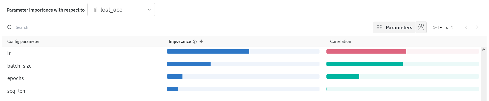
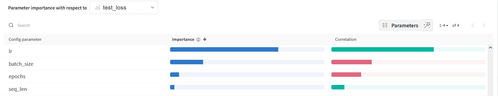

# KIV / ANLP Exercise 05

*Maximum points: 20 + 5*
**Deadline**: 15. 12. 2023 23:59:59

# Implement and run experiments [10pt]

1. **Run Experiments with different Hyper-parameters [5pt]**

       "task":"sts",     # < 0.65
       #"task": "sentiment",  # > 0.75

        "model_type": "UWB-AIR/Czert-B-base-cased",
        #"model_type": "ufal/robeczech-base",
        #"model_type": "fav-kky/FERNET-C5",

   **The best performing configuration run at least 5 times for each model and dataset**
   To these runs add special tag : `best`
   Conclude your results in table of results.

2. You can use python transformer package [https://huggingface.co/] [https://huggingface.co/docs/transformers/en/index]:

- AutoTokenizer.from_pretrained(model_name)
- AutoModelForSequenceClassification.from_pretrained(model_name)
- AutoModel.from_pretrained(model_name)

3. **[5pt]** **Tune More Voluntarily**
   You can use any technique and model.

- If you are interested in experimenting with prompting techniques or other models, please let me know, and we can
  discuss a way forward.

Best performing student gets 5 extra points.
If confidence intervals of more students overlay, each student gets extra points.

# My results **[10pt]**

## Hyper Parameter Analysis

### Parallel Coordinate Chart

The tuned hyperparameters are (for each model and task):

- learning rate (lr): 1e-4, 1e-5, 1e-3
- batch size: 16, 32, 64
- epochs: 5, 10, 15
- sequence length: 64, 128

---
Sentiment task:

The learning rate is the most important hyperparameter for the sentiment task.
The smallest tested learning rate 0.00001 seems to be the best for FERNET-C5 and Czert-B-base-cased models.
The best learning rate for the robeczech-base model is 0.0001.

The batch size is the second most important hyperparameter for the sentiment task.
It seems that models with bigger batch sizes were performing better.
This makes sense because models trained with larger batch sizes might benefit from reduced variance in gradient
estimates, leading to more reliable updates and faster convergence.

---
STS task:

Again the learning rate is the most important hyperparameter for the STS task.
The smallest tested learning rate 0.00001 seems to be the best in this case as well.

### Discussion

Based on graphs above, the best hyperparameters for each model and task were chosen as follows:

## STS Task

### Hyperparameters

- **Learning Rate**: 0.00001

#### Model: UWB-AIR/Czert-B-base-cased

- **Batch Size**: 16
- **Epochs**: 10
- **Sequence Length**: 128

#### Model: ufal/robeczech-base

- **Batch Size**: 32
- **Epochs**: 15
- **Sequence Length**: 128

#### Model: fav-kky/FERNET-C5

- **Batch Size**: 32
- **Epochs**: 5
- **Sequence Length**: 64

## Sentiment Task

### Hyperparameters

- **Sequence Length**: 128

#### Model: UWB-AIR/Czert-B-base-cased

- **Batch Size**: 64
- **Epochs**: 10
- **Learning Rate**: 0.0001

#### Model: ufal/robeczech-base

- **Batch Size**: 16
- **Epochs**: 10
- **Learning Rate**: 0.00001

#### Model: fav-kky/FERNET-C5

- **Batch Size**: 64
- **Epochs**: 5
- **Learning Rate**: 0.00001

## Charts

### STS charts (15 charts)

All the models tested with their respective best hyperparameters yielded comparable results, indicating consistent
performance across architectures. Among these, the Czert-B-base-cased model emerged as the top-performing model,
achieving an average STS test loss of 0.501, which highlights its ability to evaluate semantic similarity between text
pairs
effectively.

The graph below illustrates the test loss curve for the Czert-B-base-cased model with its optimal hyperparameters. The
smooth downward trajectory and convergence of the curve indicate a successful and stable training process.

### sentiment charts (15 charts)

For the sentiment analysis task, robeczech-base achieved the highest test accuracy, standing out as the best-performing
model in terms of classification precision. However, it exhibited the highest test loss, suggesting potential issues
such as overfitting or lack of generalization.

On the other hand, the FERNET-C5 model demonstrated the lowest loss across all models, reflecting its robustness and
generalization capability. Despite ranking second in test accuracy, its balance of low loss and strong performance makes
it the most suitable model for this task, in my opinion, with a test accuracy of 0.846.

The following graphs depict the test accuracy and loss curves for the FERNET-C5 model under its optimal configuration.
The curves show the expected shapes for a well-trained model, with steady improvements and convergence during training.

## Table of results ##

|                | Baseline       | Czert-B-base-cased | robeczech-base | FERNET-C5      |
|----------------|----------------|--------------------|----------------|----------------|
| sts            | 3.222 +- 0.032 | 0.501 +- 0.011     | 0.552 +- 0.027 | 0.503 +- 0.006 |
| sentiment-csfd | 0.75 +- 0.002  | 0.840 +- 0.003     | 0.848 +- 0.001 | 0.846 +- 0.003 |

All the models easily outperformed the baseline, this is especially good for the sentiment task, where previously
none of the CNN architectures reached the 0.75 accuracy threshold.

We run 5 experiments for each setup and present average and error.
The baseline is taken from previous exercises in the semester. Please write details for the baseline
---

STS baseline: I used the dummy model which computes the mean STS value of the dataset in the initialization phase and
returns this value as a prediction independently on model inputs.

Sentiment baseline: model which uses average of sequence embeddings to represent the sequence. The baseline model
above uses embedding projection (size 100).

### Discussion

Který model byl nejlepší? Proč?
- Sentiment Task: While robeczech-base achieved the highest accuracy, the FERNET-C5 model demonstrated better loss and generalization, making it the better overall choice.
- STS Task: The Czert-B-base-cased model was the most effective, with the lowest test loss and stable training.

Jaké parametry jsem tunil?

Learning Rate, Batch Size, Epochs, Sequence Length (see above)

Které měly největší vliv?

- Learning Rate: The single most impactful hyperparameter for both tasks.
- Batch Size: Particularly important for sentiment analysis due to its impact on gradient estimation stability.

Jaké další techniky pro stabilnější nebo lepší výsledky jsem použil?

- Learning rate scheduling: Used a learning rate scheduler to adjust the learning rate during training.
